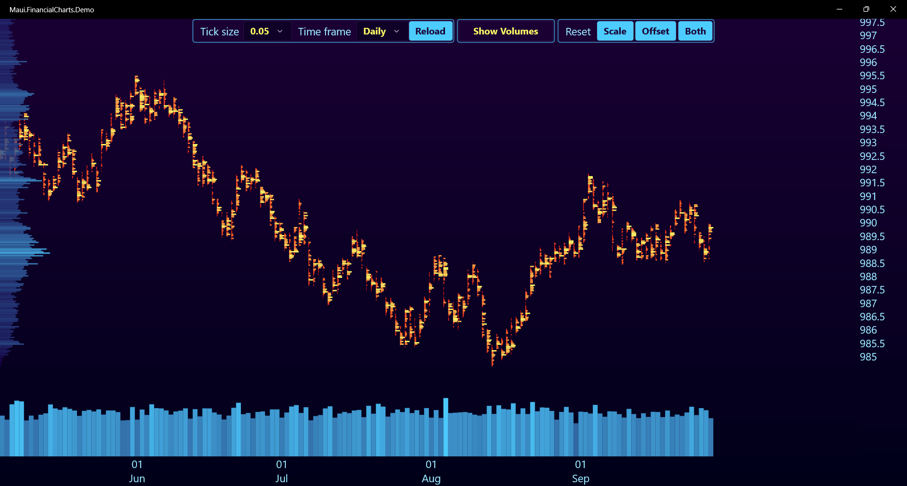
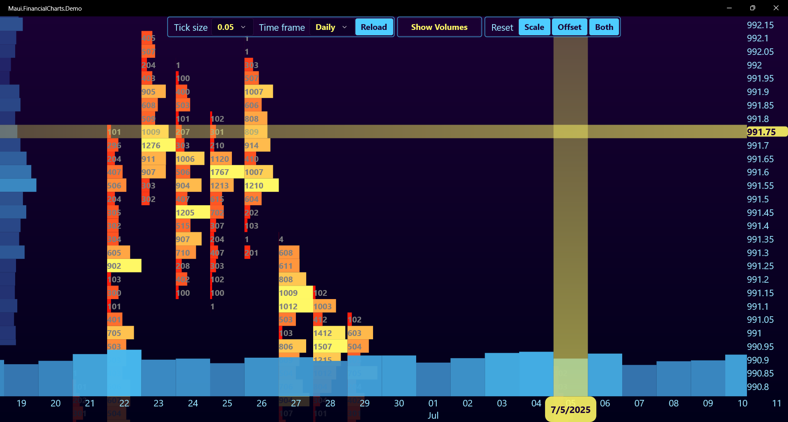

# MAUI.FinancialCharts 📈 [Work in Progress] 🚧

MAUI control for visualizing market tick data as volume clusters.

## ⚠️ Note

This control is specifically optimized for static, historical data visualization. 
It is not designed for real-time streaming data.

## 🚀 Getting Started

- Add namespace
```xml
<ContentPage ...
	     xmlns:controls="clr-namespace:Maui.FinancialCharts.Controls;assembly=Maui.FinancialCharts"
	     ...>
```
- Create control
```xml
<controls:ClusterChart x:Name="clusterChart"
		       DataSource="{Binding TickDataProvider}"
		       TickSize="0.5"
		       TimeFrame="Daily"
		       VerticalHistogram="True"
		       HorizontalHistogram="True"/>
```

## 📋 Bindable Properties

### ```DataSource```
The source of tick data that implements `ITickDataProvider` interface.
###	```TickSize```
Minimum step of price scale represented by `double`. Default `0.05`.
### ```TimeFrame```
Minimum step of time scale represented by `enum`. Default `Daily`.
### ```VerticalHistogram```
Defines whether vertical volume histogram is visible. Default `true`.
### ```HorizontalHistogram```
Defines whether horizontal volume histogram is visible. Default `true`.

## 🎨 Customizable Colors

### ```BackgroundColorFrom```
Defines upper color of background gradient.
### ```BackgroundColorTo```
Defines lower color of background gradient.
### ```ClusterMinColor```
Defines the color of the cluster with the minumum volume.
### ```ClusterMaxColor```
Defiens the color of the cluster with the maximum volume.
### ```HistogramMinColor```
Defines the color of the histogram bar with the minimum volume.
### ```HistogramMaxColor```
Defines the color of the histogram bar with the maximum volume.
### ```PriceColor```
Defines the color of the price scale text.
### ```TimeColor```
Defines the color of the time scale text.
### ```MessageColor```
Defines the color of state messages.
### ```VolumeTextColor```
Defines the color of cluster volume text.
### ```LabelTextColor```
Defines the color of line labels.
### ```LinesColor```
Defines the color of price and time lines.

## 🔌 Interface ```ITickDataProvider```

```csharp
public interface ITickDataProvider {
    IAsyncEnumerable<MarketTick> GetTicksAsync(CancellationToken token = default);
}
```

## 📊 Struct ```MarketTick```

Represents a market tick
```csharp
public record struct MarketTick(
	DateTime Time,
	double Price,
	int Volume
);
```

## 🎮 Demo

An example of usage with pseudo-market data generated by implementation of `ITickDataProvider`
in the `FakeTickDataProvider` class.
### Control
- **Panning:** Click and drag chart area
- **X-axis scaling:** Click and drag time area
- **Y-axis scaling:** Click and drag price area
- **Line placement:** Press and release left mouse button on time/price area, move mouse along the area, then click again to place the line.
- **Line repositioning:** Press and release left mouse button on an existing line and move mouse to new position, or move mouse out of area to delete line.
### 📷 Screenshots



## 🌍 PLatform Support

| Platform | Status | Note |
|----------|--------|------|
| Windows 10/11 | ✅ Fully Supported | Main development platform |
| Android | ⚠️ Experimental | Issues with colors and transparency. Touch controls not fully implemented |
| iOS | ❌ Not Tested |
| macOS | ❌ Not Tested |

## 🐛 Known Issues

### Android
- Colors and gradients display incorrectly
- Background overlaps chart elements
- Transparency effects don't work properly
- 
## 📅 Roadmap

- Implement rendering using SkiaSharp for better cross-platform consistency
- Improve Android support
- Add iOS and macOS testing
